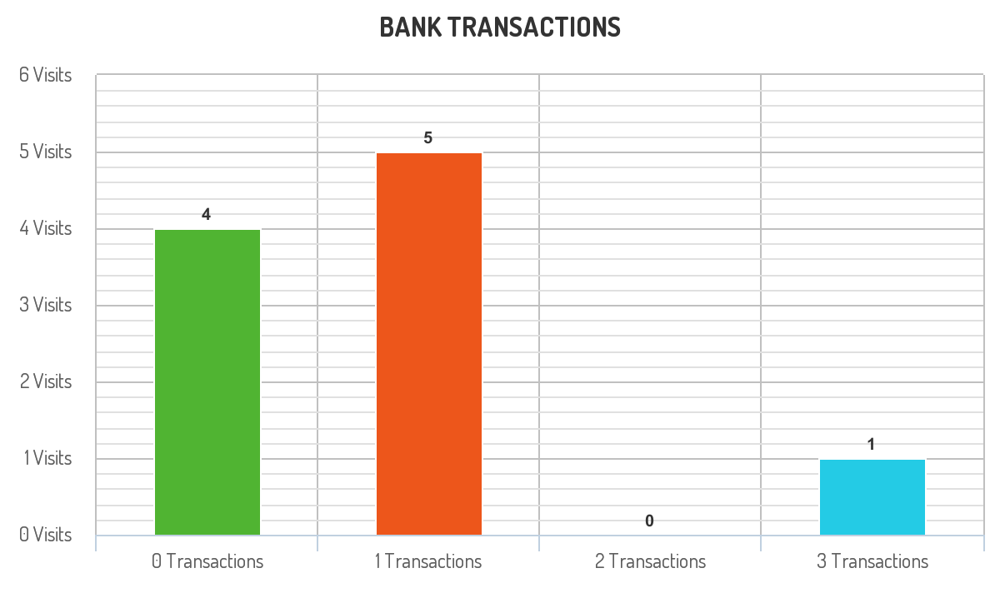

#  Number of Transactions per Visit

- [Tables for the problem](#tables)
- [Task](#task)
- [Description of the Solution](#description-of-the-solution)
- [Explanation](#explanation)
- [Schemas & Scripts](#schemas--scripts)

## Tables 

**Table**: `VISITS`

| Column Name | Type |
|-------------|------|
| user_id     | int  |
| visit_date  | date |

`(user_id, visit_date)` is the primary key (combination of columns with unique values) for this table.

Each row of this table indicates that `user_id` has visited the bank in `visit_date`.

**Table**: `TRANSACTIONS`

| Column Name      | Type |
|------------------|------|
| user_id          | int  |
| transaction_date | date |
| amount           | int  |

This table may contain duplicates rows.

Each row of this table indicates that user_id has done a transaction of amount in transaction_date.

It is guaranteed that the user has visited the bank in the `transaction_date`.(i.e The Visits table 
contains `(user_id, transaction_date)` in one row)

## Task

A bank wants to draw a chart of the number of transactions bank visitors did in one visit to the bank and the 
corresponding number of visitors who have done this number of transaction in one visit.

Write a solution to find how many users visited the bank and didn't do any transactions, how many visited the bank 
and did one transaction, and so on.

The result table will contain two columns:

- `transactions_count` which is the number of transactions done in one visit.
- `visits_count` which is the corresponding number of users who did transactions_count in one visit to the bank.

`transactions_count` should take all values from `0` to `max(transactions_count)` done by one or more users.

**Return** the result table ordered by `transactions_count`.

## Description of the Solution ##

The result format is in the following example.



Example 1:

Input: 
VISITS table:

| user_id | visit_date |

| 1       | 2020-01-01 |
| 2       | 2020-01-02 |
| 12      | 2020-01-01 |
| 19      | 2020-01-03 |
| 1       | 2020-01-02 |
| 2       | 2020-01-03 |
| 1       | 2020-01-04 |
| 7       | 2020-01-11 |
| 9       | 2020-01-25 |
| 8       | 2020-01-28 |

TRANSACTIONS table:

| user_id | transaction_date | amount |

| 1       | 2020-01-02       | 120    |
| 2       | 2020-01-03       | 22     |
| 7       | 2020-01-11       | 232    |
| 1       | 2020-01-04       | 7      |
| 9       | 2020-01-25       | 33     |
| 9       | 2020-01-25       | 66     |
| 8       | 2020-01-28       | 1      |
| 9       | 2020-01-25       | 99     |

Output: 

| transactions_count | visits_count |

| 0                  | 4            |
| 1                  | 5            |
| 2                  | 0            |
| 3                  | 1            |

## Explanation ##

The chart drawn for this example is shown above.
- For `transactions_count = 0`, The visits `(1, "2020-01-01")`, `(2, "2020-01-02")`, 
`(12, "2020-01-01")` and `(19, "2020-01-03")` did no transactions so `visits_count = 4`.
- For `transactions_count = 1`, The visits `(2, "2020-01-03")`, `(7, "2020-01-11")`, `(8, "2020-01-28")`, 
`(1, "2020-01-02")` and `(1, "2020-01-04")` did one transaction so `visits_count = 5`.
- For `transactions_count = 2`, No customers visited the bank and did two transactions so 
`visits_count = 0`.
- For `transactions_count = 3`, The visit `(9, "2020-01-25")` did three transactions so 
`visits_count = 1`.
- For `transactions_count >= 4`, No customers visited the bank and did more than three transactions 
so we will stop at `transactions_count = 3`.

## Schemas & scripts

### SQL Schema

```genericsql
-- Create the tables
Create table If Not Exists Visits (user_id int, visit_date date)
Create table If Not Exists Transactions (user_id int, transaction_date date, amount int)

-- Populate the visits table    
Truncate table Visits
insert into Visits (user_id, visit_date) values ('1', '2020-01-01')
insert into Visits (user_id, visit_date) values ('2', '2020-01-02')
insert into Visits (user_id, visit_date) values ('12', '2020-01-01')
insert into Visits (user_id, visit_date) values ('19', '2020-01-03')
insert into Visits (user_id, visit_date) values ('1', '2020-01-02')
insert into Visits (user_id, visit_date) values ('2', '2020-01-03')
insert into Visits (user_id, visit_date) values ('1', '2020-01-04')
insert into Visits (user_id, visit_date) values ('7', '2020-01-11')
insert into Visits (user_id, visit_date) values ('9', '2020-01-25')
insert into Visits (user_id, visit_date) values ('8', '2020-01-28')

-- Populate the transactions table    
Truncate table Transactions
insert into Transactions (user_id, transaction_date, amount) values ('1', '2020-01-02', '120')
insert into Transactions (user_id, transaction_date, amount) values ('2', '2020-01-03', '22')
insert into Transactions (user_id, transaction_date, amount) values ('7', '2020-01-11', '232')
insert into Transactions (user_id, transaction_date, amount) values ('1', '2020-01-04', '7')
insert into Transactions (user_id, transaction_date, amount) values ('9', '2020-01-25', '33')
insert into Transactions (user_id, transaction_date, amount) values ('9', '2020-01-25', '66')
insert into Transactions (user_id, transaction_date, amount) values ('8', '2020-01-28', '1')
insert into Transactions (user_id, transaction_date, amount) values ('9', '2020-01-25', '99')
```

### Pandas Code

```python
# visits data
data = [[1, '2020-01-01'], [2, '2020-01-02'], [12, '2020-01-01'], [19, '2020-01-03'], 
        [1, '2020-01-02'], [2, '2020-01-03'], [1, '2020-01-04'], [7, '2020-01-11'], 
        [9, '2020-01-25'], [8, '2020-01-28']]

# visits dataframe
visits = pd.DataFrame(data, 
                      columns=['user_id', 'visit_date']) \
                     .astype({'user_id':'Int64', 'visit_date':'datetime64[ns]'})

# transactions data
data = [[1, '2020-01-02', 120], [2, '2020-01-03', 22], [7, '2020-01-11', 232], 
        [1, '2020-01-04', 7], [9, '2020-01-25', 33], [9, '2020-01-25', 66], 
        [8, '2020-01-28', 1], [9, '2020-01-25', 99]]

# transactions dataframe
transactions = pd.DataFrame(data, 
                            columns=['user_id', 'transaction_date', 'amount']) \
                           .astype({'user_id':'Int64', 'transaction_date':'datetime64[ns]', 
                                    'amount':'Int64'})
```