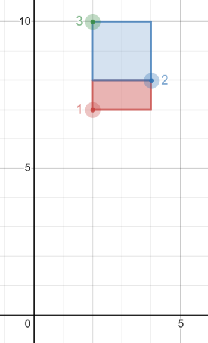

# Rectangles Area

- [Tables for the problem](#tables)
- [Task](#task)
- [Description of the Solution](#description-of-the-solution)
- [Explanation](#explanation)
- [Schemas & Scripts](#schemas--scripts)

## Tables 

**Table**: `POINTS`

| Column Name | Type |
|-------------|------|
| id          | int  |
| x_value     | int  |
| y_value     | int  |

`id` is the column with unique values for this table.

Each point is represented as a 2D coordinate `(x_value, y_value)`.

## Task

Write a solution to report all possible **axis-aligned** rectangles with a **non-zero area** that can be 
formed by any two points from the `POINTS` table.

Each row in the result should contain three columns `(p1, p2, area)` where:

- `p1` and `p2` are the `id`'s of the two points that determine the opposite corners of a rectangle.
- `area` is the area of the rectangle and must be **non-zero**.

**Return** the result table **ordered** by `area` in **descending order**. If there is a tie, order them by p1 **in 
ascending order**. If there is still a tie, order them by `p2` **in ascending order**.

## Description of the Solution ##

The result format is in the following table.

Example 1:



Input: 
POINTS table:

| id  | x_value | y_value |
|-----|---------|---------|
| 1   | 2       | 7       |
| 2   | 4       | 8       |
| 3   | 2       | 10      |

Output: 

| p1  | p2  | area |
|-----|-----|------|
| 2   | 3   | 4    |
| 1   | 2   | 2    |

## Explanation ##

- The rectangle formed by `p1 = 2` and `p2 = 3` has an area equal to `|4-2| * |8-10| = 4`.
- The rectangle formed by `p1 = 1` and `p2 = 2` has an area equal to `|2-4| * |7-8| = 2`.

Note that the rectangle formed by `p1 = 1` and `p2 = 3` is invalid because the area is `0`.

## Schemas & scripts

### SQL Schema

```genericsql
-- Create the points table
Create table If Not Exists Points (id int, x_value int, y_value int)

-- Populate the points table
Truncate table Points
insert into Points (id, x_value, y_value) values ('1', '2', '7')
insert into Points (id, x_value, y_value) values ('2', '4', '8')
insert into Points (id, x_value, y_value) values ('3', '2', '10')
```

### Pandas Code

```python
# points data
data = [[1, 2, 7], [2, 4, 8], [3, 2, 10]]

# points dataframe
points = pd.DataFrame(data, 
                      columns=['id', 'x_value', 'y_value']) \
                     .astype({'id':'Int64', 'x_value':'Int64', 'y_value':'Int64'})
```